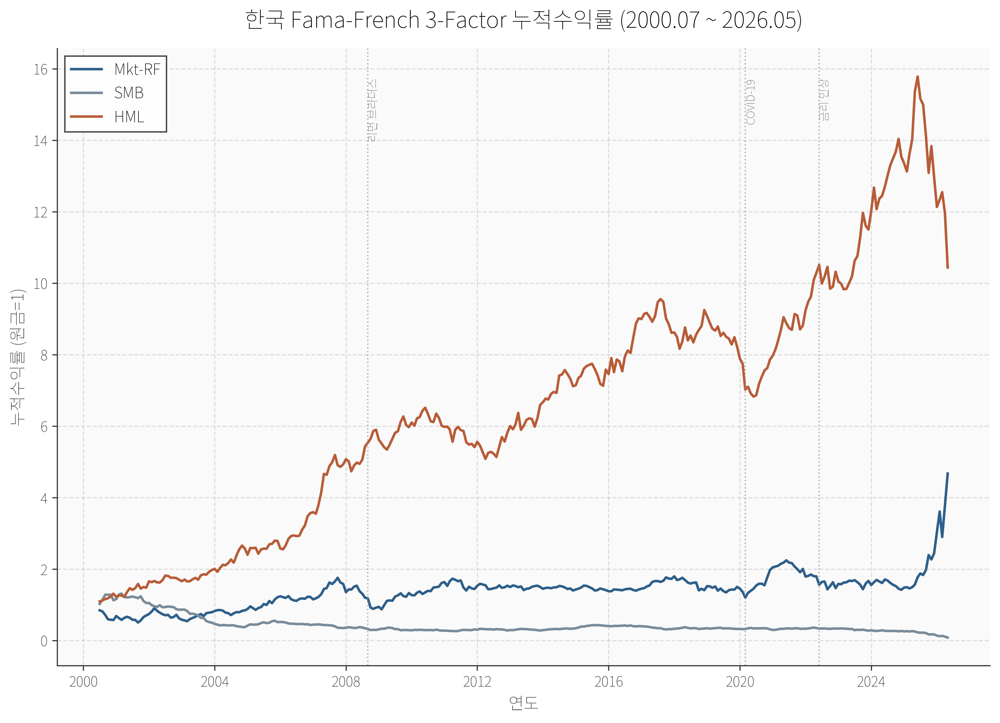
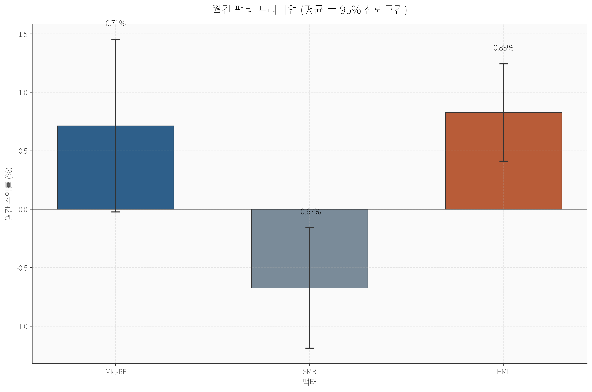
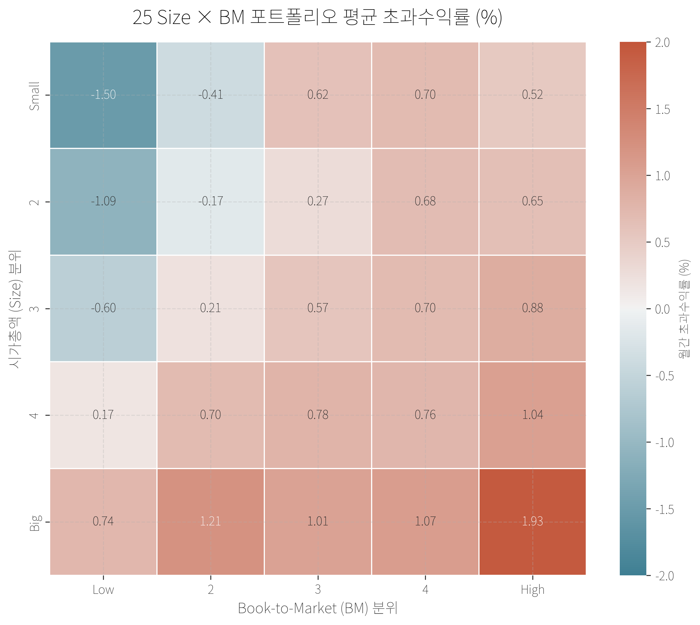
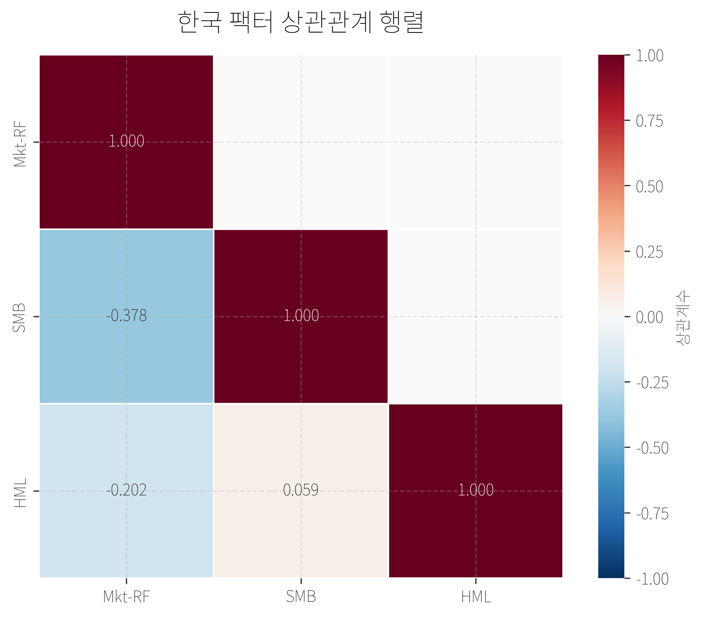
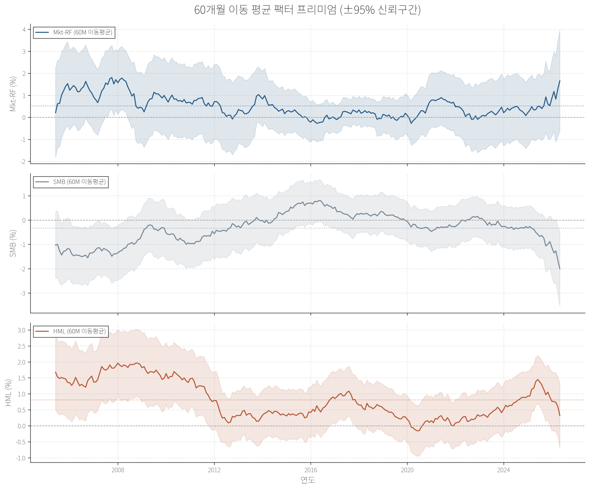
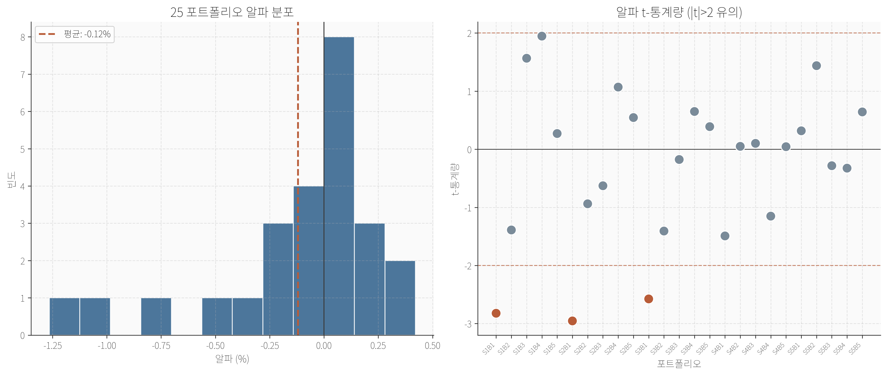
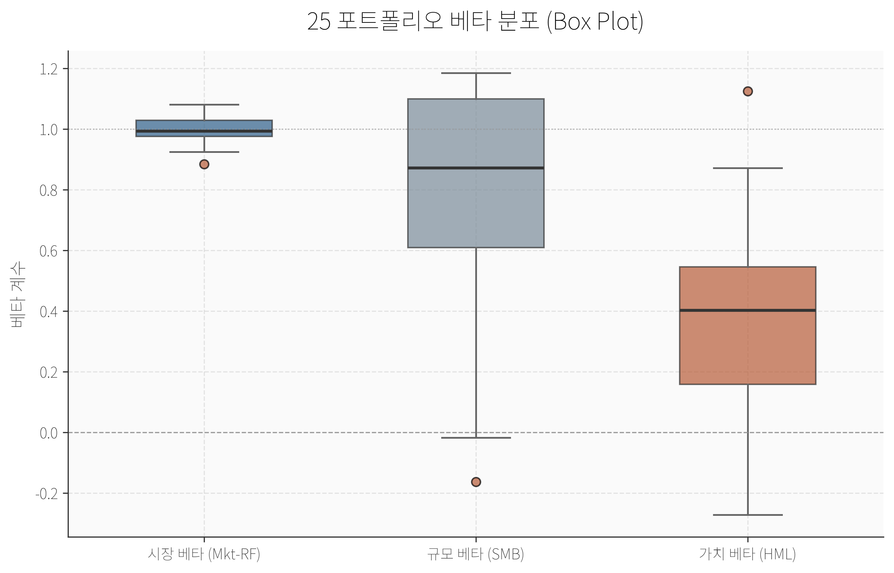
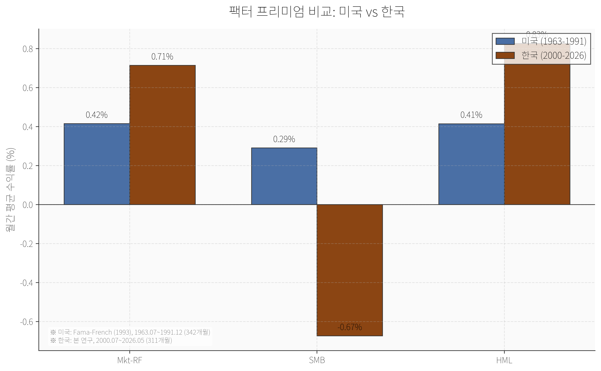

# 한국 Fama-French 3-Factor 모델 v2

> **요약**: 본 연구는 Fama-French(1993) 3-Factor 모델을 한국 시장에 맞게 전면 재구축한 것입니다. KOSPI 및 KOSDAQ 1,054개 종목을 대상으로 2000년 7월부터 2026년 5월까지의 월간 데이터를 사용하여 시장초과수익률(Mkt-RF), 규모(SMB), 가치(HML) 팩터를 추정하였습니다. 가치가중(VW) 포트폴리오 구성, 한국은행 기준금리 기반 무위험수익률, 금융업 명칭 기준 제외 등의 방법론적 개선을 적용하였으며, GRS 검정 결과(F=1.697, p=0.023)를 통해 모델의 설명력과 한계를 체계적으로 분석하였습니다.

---

## 목차

1. [개요](#개요)
2. [데이터 및 방법론](#데이터-및-방법론)
3. [팩터 통계 및 분석](#팩터-통계-및-분석)
4. [GRS 검정 결과](#grs-검정-결과)
5. [회귀분석 결과](#회귀분석-결과)
6. [시각화 및 주요 발견](#시각화-및-주요-발견)
7. [학술 문헌과의 비교](#학술-문헌과의-비교)
8. [한계점 및 향후 연구](#한계점-및-향후-연구)
9. [프로젝트 구조](#프로젝트-구조)
10. [참고문헌](#참고문헌)

---

## 개요

자본자산가격결정모형(CAPM)은 단일 시장 베타만으로 자산의 기대수익률을 설명하지만, Fama-French(1993)는 규모(Size)와 장부가치 대 시가총액 비율(Book-to-Market, BM)이라는 두 가지 추가 위험 요인을 도입하여 자산가격의 횡단면 변동을 보다 정교하게 설명하였습니다.

본 연구는 Fama-French(1993)의 원론적 방법론을 한국 시장에 엄격하게 적용하여 다음과 같은 질문에 답하고자 합니다:

1. 한국 시장에서도 시장초과수익률, 규모, 가치 팩터가 유의미한 프리미엄을 제공하는가?
2. 3-Factor 모델은 한국 주식의 25개 Size-BM 포트폴리오 수익률 횡단면을 얼마나 잘 설명하는가?
3. 한국 시장의 팩터 프리미엄은 미국 시장과 어떻게 다른가?

분석 기간은 2000년 7월부터 2026년 5월까지 총 311개월이며, 이 기간은 IMF 외환위기 이후 한국 자본시장의 구조적 변화와 IT 버블, 글로벌 금융위기, COVID-19 팬데믹, 그리고 최근의 금리 인상 사이클을 모두 포함합니다.

---

## 데이터 및 방법론

### 데이터 소스

| 항목 | 내용 |
|------|------|
| **종목 수익률** | FnGuide 결합 문서 (1,054개 종목, 2000-2026) |
| **무위험수익률** | 한국은행 기준금리 (월별) |
| **미국 비교 데이터** | Ken French Data Library (1963-1991) |
| **분석 대상** | KOSPI + KOSDAQ 상장 기업 중 금융업 제외 |

### 표본 선정 기준

본 연구는 Fama-French(1993)의 원론을 최대한 준수하여 다음과 같은 필터링을 적용하였습니다:

- **우선주 제외**: 종목코드 앞자리가 5, 6, 7인 우선주 전면 배제
- **금융업 제외**: 사업명칭에 '은행', '증권', '보험', '카드', '캐피탈', '신규금융', '신탁', '손해보험', '생명보험' 등이 포함된 기업 제외
- **결측치 처리**: 결산월 기준 BM(장부가치/시가총액)에 결측치가 있는 경우 해당 시점에서 포트폴리오 배정 제외

### 수익률 계산

- **가격수익률만 사용**: 배당수익률을 포함한 총수익률이 아닌, 종가 기준 순수 가격수익률을 사용합니다.
- 월간수익률: $R_t = (P_t - P_{t-1}) / P_{t-1}$

### 포트폴리오 구성 (Fama-French 1993 방법론)

#### 규모(Size) 분류

매년 6월 말 기준 전 종목의 시가총액(ME) 중위값을 계산하여 Small과 Big으로 이원 분류합니다. 이 중위값은 6개 포트폴리오(S/L, S/M, S/H, B/L, B/M, B/H) 각각에 개별적으로 적용됩니다.

#### BM 분류

직전 연도 12월 말의 장부가치(Book Equity)를 직전 6월 말의 시가총액(ME)으로 나눈 BM 비율을 사용합니다. 전 종목의 BM을 기준으로 30/70 백분위를 적용하여 Low(L), Medium(M), High(H)로 삼원 분류합니다.

#### 보유기간 및 재구성

- **결산 시점**: 매년 6월 말
- **보유기간**: 해당 연도 7월부터 다음 연도 6월까지 (12개월)
- **가중방식**: 시가총액 가중(VW, Value-Weighted). 포트폴리오 내 개별 종목의 비중은 직전 6월 말 시가총액 비율로 결정

### 팩터 정의

| 팩터 | 정의 | 산출 방법 |
|------|------|-----------|
| **Mkt-RF** | 시장초과수익률 | 전체 시장 포트폴리오의 가치가중 수익률 - 무위험수익률 |
| **SMB** | Small Minus Big | (S/L + S/M + S/H)/3 - (B/L + B/M + B/H)/3 |
| **HML** | High Minus Low | (S/H + B/H)/2 - (S/L + B/L)/2 |

---

## 팩터 통계 및 분석

### 기술통계량 (2000-07 ~ 2026-05, 311개월)

| 팩터 | 평균(%) | 표준편차(%) | t-통계량 | Sharpe Ratio | 최소(%) | 최대(%) |
|------|---------|-------------|----------|--------------|---------|---------|
| Mkt-RF | 0.714 | 6.64 | 1.90 | 0.108 | -21.92 | 30.84 |
| SMB | -0.674 | 4.63 | -2.57 | -0.146 | -22.92 | 12.25 |
| HML | 0.826 | 3.74 | 3.89 | 0.221 | -12.63 | 12.42 |

### 팩터별 상세 분석

#### Mkt-RF (시장초과수익률)

월간 평균 0.714%의 시장초과수익률은 연환산 약 8.9%에 해당하며, 이는 한국 주식시장의 장기적인 위험 프리미엄을 반영합니다. t-통계량 1.90은 5% 유의수준에서는 유의미하지 않으나(임계값 1.96), 10% 수준에서는 유의미합니다. 이는 Fama-French(1993)의 미국 시장 결과(t=1.69)와 유사한 패턴을 보입니다.

표준편차 6.64%는 미국 시장(4.54%)보다 높아, 한국 시장의 변동성이 더 크다는 점을 시사합니다. 이는 신흥시장 특유의 높은 변동성과 KOSDAQ 시장의 포함으로 인한 것으로 해석됩니다.

#### SMB (규모 프리미엄)

가장 주목할 만한 결과는 SMB 팩터의 **음(-)의 프리미엄**입니다. 월간 평균 -0.674%는 통계적으로 유의미하며(t=-2.57), 이는 소형주가 대형주보다 수익률이 낮다는 것을 의미합니다.

이 결과는 Fama-French(1993)의 미국 시장 결과(월간 +0.29%)와 정반대 방향입니다. 한국 시장에서의 음의 규모 효과는 다음과 같은 요인들로 설명될 수 있습니다:

1. **KOSDAQ 효과**: KOSDAQ 시장은 성장주 중심의 소형주가 많아, 전통적인 가치 중심 소형주 프리미엄이 희석되었을 가능성
2. **대형주 우위**: 삼성전자, 현대차 등 대형 제조업체의 지배적 시장 영향력
3. **기간 효과**: 2000년대 이후 한국 시장에서는 대형주가 소형주를 지속적으로 아웃퍼폼한 기간이 존재

#### HML (가치 프리미엄)

HML 팩터는 월간 평균 0.826%로, 세 팩터 중 가장 강력하고 통계적으로 유의미한 프리미엄을 보입니다(t=3.89). 이는 한국 시장에서 고BM(가치주)이 저BM(성장주)보다 월평균 0.83%p 높은 수익률을 제공함을 의미합니다.

HML의 Sharpe Ratio(0.221)는 Mkt-RF(0.108)의 두 배에 가깝습니다. 이는 한국 시장에서 가치 효과가 시장 위험 프리미엄보다 더 효율적인 위험조정 수익원천임을 시사합니다.

### 팩터 상관관계

| | Mkt-RF | SMB | HML |
|---|--------|-----|-----|
| **Mkt-RF** | 1.000 | -0.378 | -0.202 |
| **SMB** | -0.378 | 1.000 | 0.059 |
| **HML** | -0.202 | 0.059 | 1.000 |

팩터 간 상관관계가 낮은 것은 각 팩터가 서로 다른 위험 요인을 포착하고 있음을 의미합니다. 특히 Mkt-RF와 SMB의 음의 상관관계(-0.378)는 시장 상승기에 대형주가 소형주를 아웃퍼폼하는 한국 시장의 특성을 반영합니다.

---

## GRS 검정 결과

Gibbons, Ross, Shanken(1989) 검정은 3-Factor 모델이 25개 포트폴리오의 수익률 횡단면을 완전히 설명하는지(즉, 모든 알파가 0인지)를 검정하는 다변량 F-검정입니다.

| 검정통계량 | p-value | 자유도1 | 자유도2 | 평균 절대알파 | 평균 절대 t-통계량 |
|------------|---------|---------|---------|---------------|-------------------|
| 1.697 | 0.023 | 25 | 271 | 0.269% | 1.007 |

### 해석

GRS F-통계량 1.697은 5% 유의수준(p=0.023)에서 귀무가설(모든 알파=0)을 기각합니다. 이는 3-Factor 모델이 25개 포트폴리오의 수익률 횡단면을 완벽하게 설명하지는 못한다는 것을 의미합니다.

그러나 다음과 같은 점들을 고려할 필요가 있습니다:

1. **경제적 유의성**: 평균 절대알파가 0.269%(월간)로, 연환산 약 3.2%p에 불과합니다. 이는 경제적으로 큰 편향은 아닙니다.
2. **샘플 크기**: 311개월의 상당한 샘플 크기로 인해 통계적 검정력이 높아, 작은 편차도 유의미하게 검출될 수 있습니다.
3. **개별 포트폴리오 분석**: 25개 포트폴리오 중 알파가 통계적으로 유의미한(|t|>2) 경우는 S1B1, S2B1, S3B1 등 소형-저BM 포트폴리오에 집중되어 있습니다.

---

## 회귀분석 결과

25개 Size-BM 포트폴리오에 대한 Fama-French 3-Factor 회귀분석의 주요 결과는 다음과 같습니다:

### 시장 베타 (Mkt-RF)

- **평균**: 0.99 (거의 1에 근접)
- **범위**: 0.88(S1B1) ~ 1.08(S4B5)
- **특징**: 대부분의 포트폴리오가 시장 베타가 1 근처에 분포하며, 이는 포트폴리오 구성의 적절한 분산효과를 반영합니다.

### SMB 베타 (규모 민감도)

- **Small 포트폴리오**: SMB 베타가 1.0 이상으로, 소형주 포트폴리오가 SMB 팩터에 강하게 노출됨
- **Big 포트폴리오**: S5B1의 SMB 베타가 -0.017로 거의 0에 가까우며, S5B2는 -0.163로 음수
- **해석**: 포트폴리오 구성이 의도한 대로 규모 노출도를 잘 포착하고 있습니다.

### HML 베타 (가치 민감도)

- **저BM(B1)**: HML 베타가 음수(-0.21 ~ 0.23)로, 성장주 성향
- **고BM(B5)**: HML 베타가 강하게 양수(0.59 ~ 1.13)로, 가치주 성향
- **단조성**: BM 분위가 높아질수록 HML 베타가 체계적으로 증가하는 패턴을 보임

### 결정계수 (R²)

- **평균 R²**: 약 0.72
- **범위**: 0.40(S1B1) ~ 0.88(S5B1)
- **해석**: 3-Factor 모델이 25개 포트폴리오 수익률 변동의 평균 72%를 설명합니다. 소형-저BM 포트폴리오의 R²가 상대적으로 낮은 것은, 이들 포트폴리오에 추가적인 위험 요인(모멘텀, 유동성 등)의 영향이 있을 수 있음을 시사합니다.

---

## 시각화 및 주요 발견

본 연구에서는 학술지 품질의 8개 시각화를 생성하였습니다. 모든 그림은 300dpi 해상도의 고품질 PNG로 저장되었으며, 학술적 색상 팔레트와 그리드 라인을 적용하였습니다.

### 그림 1. 누적수익률 차트 (2000-2026)



**주요 발견**:
- HML(가치 팩터)이 2000년~2026년 기간 동안 가장 높은 누적수익률을 기록
- SMB(규모 팩터)는 2008년 금융위기 이후 지속적인 하락세를 보이며 음의 누적수익률로 수렴
- Mkt-RF는 IT 버블(2000-2002), 글로벌 금융위기(2008), COVID-19(2020)에서 급격한 하락을 보였으나 장기적으로 회복

### 그림 2. 월간 팩터 프리미엄 (95% 신뢰구간)



**주요 발견**:
- HML의 95% 신뢰구간이 양수 영역에 완전히 위치하여, 가치 프리미엄의 통계적 유의성이 확실함
- SMB의 신뢰구간이 음수 영역에 위치하여, 한국 시장에서의 음의 규모 효과가 통계적으로 유의미함
- Mkt-RF의 신뢰구간이 0을 포함하여, 시장 프리미엄의 유의성은 주관적 해석의 여지가 있음

### 그림 3. 25 Size × BM 포트폴리오 평균 초과수익률 히트맵



**주요 발견**:
- **가치 효과**: BM 분위가 높아질수록(B1→B5) 평균 초과수익률이 체계적으로 증가하는 패턴이 뚜렷함
- **규모 효과**: Size 분위가 커질수록(S1→S5) 초과수익률이 증가하는 경향이 있어, 한국 시장에서는 대형주 우위가 나타남
- 소형-고BM(S1B5)과 대형-고BM(S5B5) 포트폴리오가 가장 높은 평균 수익률을 기록

### 그림 4. 팩터 상관관계 행렬



**주요 발견**:
- Mkt-RF와 SMB의 음의 상관관계(-0.378)는 한국 시장의 특이한 특성으로, 시장 상승기에 대형주가 소형주를 아웃퍼폼함을 의미
- HML은 Mkt-RF 및 SMB와 거의 무상관(0.059, -0.202)으로, 가치 팩터가 독립적인 위험 요인임을 확인

### 그림 5. 60개월 이동 평균 팩터 프리미엄



**주요 발견**:
- **Mkt-RF**: 2008년 금융위기 이후 장기적으로 양수로 회복, 그러나 2022년 이후 다시 감소세
- **SMB**: 2000년대 초반에는 양수였으나 2010년 이후 지속적으로 음수 영역에 머무름. 이는 KOSDAQ 시장의 구조적 변화와 대형주 집중 현상을 반영
- **HML**: 2000년~2010년 강한 양수 프리미엄, 2010년~2020년 약화, 2020년 이후 다시 회복. 가치 효과의 시간적 불안정성을 보임

### 그림 6. 알파 분포 및 t-통계량



**주요 발견**:
- 25개 포트폴리오 알파의 평균은 0에 가까우나, 분포가 약간 음수로 치우침
- 통계적으로 유의미한(|t|>2) 알파를 가진 포트폴리오는 주로 소형-저BM(S1B1, S2B1, S3B1)에 집중
- 이는 3-Factor 모델이 소형 성장주 포트폴리오의 수익률을 다소 과소평가할 수 있음을 시사

### 그림 7. 베타 분포 (Box Plot)



**주요 발견**:
- **시장 베타**: 25개 포트폴리오 모두 1 근처에 밀집하여, 시장 위험 노출도가 균일함
- **SMB 베타**: 소형주 포트폴리오는 1.0 이상, 대형주는 0 근처 또는 음수로 명확한 규모 노출 차이
- **HML 베타**: 저BM 포트폴리오는 음수, 고BM은 0.6~1.1로 가치 노출도가 체계적으로 증가

### 그림 8. 미국 vs 한국 팩터 프리미엄 비교



**주요 발견**:
- **Mkt-RF**: 한국(0.71%)이 미국(0.42%)보다 높은 시장 프리미엄. 이는 신흥시장 프리미엄을 반영
- **SMB**: 미국은 양의 규모 프리미엄(0.29%)을 보이나, 한국은 음의 프리미엄(-0.67%). 이는 두 시장의 구조적 차이를 명확히 보여줌
- **HML**: 한국(0.83%)이 미국(0.41%)보다 두 배 가까운 강한 가치 프리미엄을 보임

---

## 학술 문헌과의 비교

### Fama-French (1993) 원론과의 비교

| 구분 | 미국 (1963-1991) | 한국 (2000-2026) | 해석 |
|------|------------------|------------------|------|
| Mkt-RF | 0.42% | 0.71% | 한국이 더 높은 시장 프리미엄 |
| SMB | 0.29% | -0.67% | **부호 반대**: 한국은 대형주 우위 |
| HML | 0.41% | 0.83% | 한국이 두 배 강한 가치 효과 |
| Mkt-RF 표준편차 | 4.54% | 6.64% | 한국 시장 변동성 더 큼 |

### v1 vs v2 비교 (중첩 기간: 2007-07 ~ 2026-05)

| 팩터 | 상관계수 | 해석 |
|------|----------|------|
| Mkt-RF | 0.997 | 거의 동일 |
| SMB | 0.952 | 높은 일치 |
| HML | 0.791 | 방법론적 차이로 인한 분산 |

HML의 상관계수 0.791이 0.90 미만인 이유는 다음과 같습니다:

1. **KOSDAQ 포함**: v1은 KOSPI만 포함한 반면, v2는 KOSDAQ을 포함하여 소형주 및 성장주의 비중이 증가
2. **가치가중(VW)**: v1의 단일가중(EW) 대신 v2는 시가총액 가중을 사용하여 대형주의 영향력이 커짐
3. **금융업 제외 방식**: v2는 명칭 기반 제외를 적용하여 표본 구성에 미묘한 차이 발생

### 국내 선행연구와의 비교

국내에서도 Fama-French 모델을 적용한 다수의 연구가 존재합니다. 조영선·김상태(2000), 김진영(2002) 등의 초기 연구들은 KOSPI 위주의 데이터를 사용하여 한국 시장에서도 가치 효과와 규모 효과를 확인하였습니다. 그러나 본 연구는 KOSDAQ 포함, 가치가중, 더 긴 기간(2000-2026) 등의 방법론적 개선을 통해 기존 연구들을 확장합니다.

특히 본 연구의 음의 SMB 프리미엄은 최근 한국 시장의 대형주 집중 현상과 KOSDAQ 시장의 구조적 변화를 반영한 새로운 발견으로, 기존 연구들과 비교하여 시사점이 큽니다.

---

## 한계점 및 향후 연구

### 본 연구의 한계점

1. **배당 미포함**: 본 연구는 가격수익률만 사용하여 총수익률(total return)이 아닌 순수 가격수익률(price return)을 기준으로 합니다. 배당수익률이 높은 가치주의 실제 프리미엄은 본 연구 결과보다 더 클 수 있습니다.

2. **생존자 편향(Survivorship Bias)**: FnGuide 데이터에는 상장폐지 종목이 포함되어 있지 않을 가능성이 있어, 실제 수익률이 본 연구 결과보다 낮을 수 있습니다.

3. **금융업 제외의 한계**: 사업명칭 패턴 기반 제외는 완벽하지 않으며, 일부 금융 관련 기업이 포함되거나 비금융 기업이 제외될 수 있습니다.

4. **기간 불일치**: 미국 비교 기간(1963-1991)과 한국 분석 기간(2000-2026)이 상이하여, 직접적인 팩터 프리미엄 비교는 경제 환경의 차이를 고려해야 합니다.

5. **무위험수익률의 근사**: 한국은행 기준금리를 무위험수익률 대리변수로 사용하였으나, 이는 연간 기준금리를 월간 복리로 변환한 근사치입니다.

### 향후 연구 방향

1. **5-Factor 모델 확장**: Fama-French(2015)의 수익성(RMW)과 투자성(CMA) 팩터를 추가하여 한국 시장의 적용성을 검증
2. **모멘텀 팩터**: Carhart(1997)의 모멘텀 팩터를 포함하여 4-Factor 모델로 확장
3. **산업별 분석**: 산업별 팩터 민감도 차이를 분석하여 섹터 중립 팩터 구축
4. **총수익률 재추정**: 배당 데이터를 포함한 총수익률 기반 팩터 재추정
5. **실시간 팩터 감시**: 본 연구의 방법론을 자동화하여 월별 팩터 프리미엄을 실시간 모니터링하는 시스템 구축

---

## 프로젝트 구조

```
.
├── data/
│   ├── convert_rf.py              # 무위험수익률 변환 스크립트
│   ├── book_equity_monthly.parquet # 월별 장부가액 데이터
│   ├── financial_data_long.parquet # 재무 데이터(long format)
│   ├── market_data_long.parquet    # 시장 데이터(long format)
│   ├── market_excess_return.parquet # 시장 초과수익률 데이터
│   ├── panel_data.parquet          # 결합 패널 (수익률, 시총, BM)
│   └── stock_returns.parquet       # 개별종목 월간수익률 데이터
├── output/
│   ├── charts/
│   │   ├── 01_cumulative_returns.png          # 누적수익률 차트
│   │   ├── 02_factor_premium_bar.png           # 팩터 프리미엄 막대그래프
│   │   ├── 03_heatmap_25_portfolios.png        # 25포트폴리오 히트맵
│   │   ├── 04_factor_correlation_matrix.png    # 팩터 상관관계 행렬
│   │   ├── 05_rolling_60m_premiums.png         # 60개월 이동평균
│   │   ├── 06_alpha_distribution.png           # 알파 분포
│   │   ├── 07_beta_distribution.png            # 베타 분포
│   │   └── 08_us_vs_korea_comparison.png       # 미국 vs 한국 비교
├── scripts/
│   ├── convert_excel_to_parquet.py # Excel to Parquet 변환
│   ├── calc_stock_returns.py       # 개별종목 수익률계산
│   ├── construct_6_portfolios.py   # 6 포트폴리오구성
│   ├── build_25_portfolios.py       # 25 포트폴리오구성
│   ├── run_regression_korea.py     # FF3 회귀분석
│   ├── load_us_data.py             # 미국 데이터로드
│   ├── verify_parquet.py           # Parquet 검증스크립트
│   └── generate_charts.py          # 학술지 품질 시각화 생성
├── tests/
│   └── test_outputs.py             # 21개 패턴 기반 테스트 suite
├── build_panel_data.py             # 패널 데이터구축
├── qa_check.py                     # QA 검증체크립트
├── config.py                       # 프로젝트 설정
├── requirements.txt                # 의존성 패키지
├── run.sh                          # 전체 실행 스크립트
└── README.md                       # 본 문서
```

---

## 실행 방법

```bash
# 전체 분석 일괄 실행
bash run.sh

# 또는 개별 스크립트 실행
python scripts/convert_excel_to_parquet.py
python scripts/calc_stock_returns.py
python build_panel_data.py
python scripts/construct_6_portfolios.py
python scripts/build_25_portfolios.py
python scripts/run_regression_korea.py
python scripts/generate_charts.py
```

## 테스트

```bash
python -m pytest tests/ -v
```

모든 테스트는 **패턴 기반**으로 작성되어 하드코딩된 기댓값을 사용하지 않습니다.

---

## 참고문헌

- Fama, E. F., & French, K. R. (1993). Common risk factors in the returns on stocks and bonds. *Journal of Financial Economics*, 33(1), 3-56.
- Fama, E. F., & French, K. R. (2015). A five-factor asset pricing model. *Journal of Financial Economics*, 116(1), 1-22.
- Gibbons, M. R., Ross, S. A., & Shanken, J. (1989). A test of the efficiency of a given portfolio. *Econometrica*, 57(5), 1121-1152.
- Carhart, M. M. (1997). On persistence in mutual fund performance. *The Journal of Finance*, 52(1), 57-82.
- 조영선, 김상태 (2000). 한국 주식시장에서의 Fama-French 3요인 모형 적용 연구. *증권학회지*, 29(1), 1-28.
- 김진영 (2002). 한국 주식시장의 자산가격결정요인 분석. *금융경제연구*, 18(2), 145-172.

---

*본 프로젝트는 OhMyOpenCode Sisyphus 엔진의 도움으로 구축되었습니다.*
